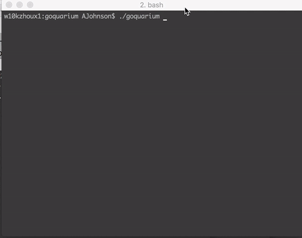

# Termination - A Go Terminal Animation Library

Loosely based on Perl's (Term::Animation)[http://search.cpan.org/~kbaucom/Term-Animation-2.6/lib/Term/Animation.pm].  This library can be used to animate ascii art on a terminal.  It uses the wonderful (termbox-go)[https://github.com/nsf/termbox-go/] for terminal manipulation.

# Main Features

- [x] Movement
- [x] Generic Movement Callbacks
- [x] Animation
- [x] Death Callbacks
- [x] Death on last Frame
- [x] Death on offscreen
- [x] Support for framerates
- [ ] Collision Support (coming soon)
 

# Usage

See the demo folder for some examples - 

	kirbyShape := termination.Shape {
	    "default": []string {
	      "  (>'-')>",
	      "  ('-')",
	      " ('-')",
	      "<('-'<) ",
	      " ('-')",
	      "  ('-')",
	 },
	}
	term := termination.New()
	term.FramesPerSecond = 5
	term.NewEntity(termination.Position{10,10,10})
	term.Shape = kirbyShape
	go term.Animate()
	term.Close()
	/* Signals get captured... see demos for better examples */

# Contribute

I'm sure you can make my code better!  Pull Requests are much appreciated

